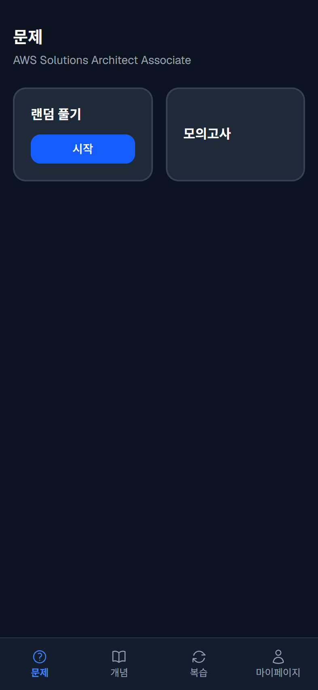
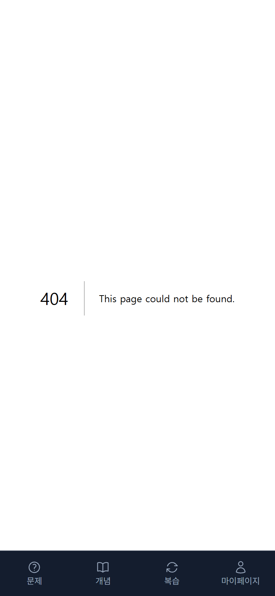
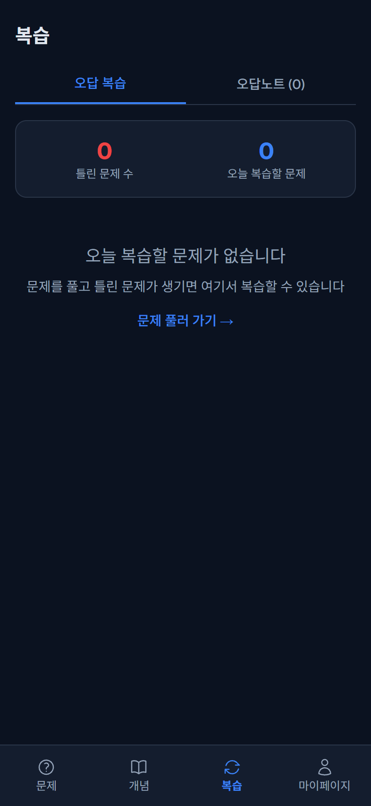
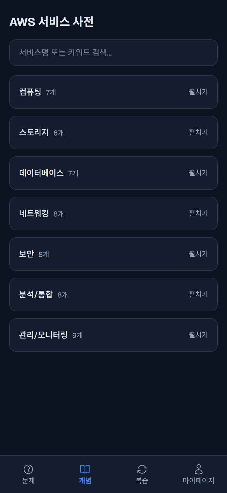
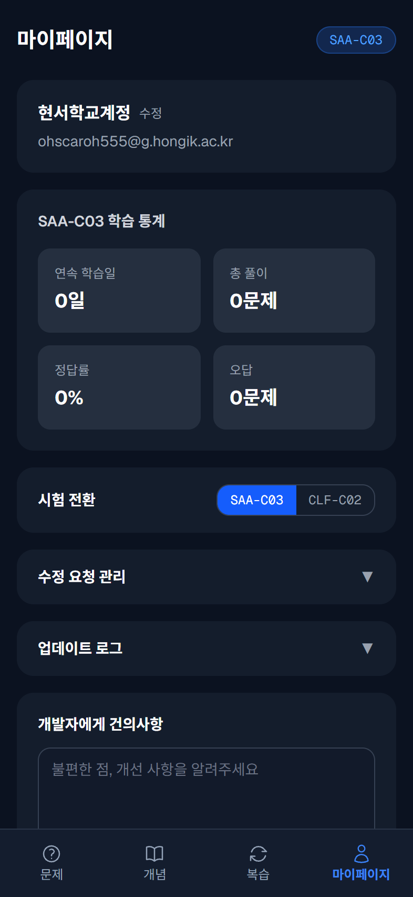

# AWS 자격증 학습 앱

AWS SAA-C03 (Solutions Architect Associate) 및 CLF-C02 (Cloud Practitioner) 시험 준비를 위한 모바일 최적화 웹앱입니다.

> 📱 모바일 브라우저에서 사용하는 것을 기본으로 설계되었습니다.

---

## 스크린샷

| 문제풀기 | 모의고사 | 오답 |
|:---:|:---:|:---:|
|  |  |  |

| 개념 | 마이페이지 |
|:---:|:---:|
|  |  |

---

## 시작하기

### 첫 접속 흐름

1. 앱에 접속하면 **로그인 / 회원가입** 화면이 표시됩니다.
2. 이메일로 회원가입 후 **시험 선택** 화면에서 학습할 시험을 고릅니다.
   - 🏗️ SAA-C03 (Solutions Architect Associate)
   - ☁️ CLF-C02 (Cloud Practitioner)
3. **닉네임**을 설정하면 메인 화면(문제풀기)으로 진입합니다.

시험 종류는 나중에 마이페이지에서 언제든 변경할 수 있습니다.

---

## 탭별 기능 가이드

하단 내비게이션에 5개 탭이 있습니다.

### 📝 문제풀기

선택한 시험에 해당하는 문제를 풀 수 있는 메인 학습 공간입니다.

- **일반 모드**: 아직 풀지 않은 문제를 우선 배치하여 랜덤 순서로 출제
- **서비스별 모드**: 개념 탭에서 특정 AWS 서비스를 선택하면 해당 서비스 관련 문제만 필터링하여 출제
- **복습 모드**: 오답 탭에서 "복습 시작"을 누르면 오늘 복습 예정인 문제만 출제
- **단일 문제 보기**: 오답 탭에서 특정 문제를 클릭하면 해당 문제 하나만 표시 (다음 문제 없음)

#### 문제 풀이 흐름

1. 선지를 선택하고 **제출** 버튼을 누릅니다.
2. 정답/오답 결과가 표시됩니다. 정답이면 축하 효과가 나옵니다.
3. **해설 보기**를 누르면 해설 / 상세 풀이 / 관련 서비스 탭을 확인할 수 있습니다.
4. **다음 문제** 버튼으로 넘어갑니다.

#### 오답노트 저장 (텍스트 드래그)

문제 지문이나 해설에서 **텍스트를 드래그(길게 누르기)**하면 팝오버가 뜨고, "오답노트에 저장"을 선택할 수 있습니다. 메모를 추가하면 오답 탭의 오답노트에 저장됩니다.

#### 수정 요청 (문제 오류 신고)

문제에 오류가 있을 때 상단의 ⚠ **수정 요청** 버튼을 누르면 신고할 수 있습니다.
- 번역 필요 / 해설 오류 / 선지 오류 / 정답 오류 / 서비스 분류 오류 / 지문 오류
- 신고 내용은 Supabase에 저장되어 관리자가 처리합니다.

---

### 📋 모의고사

실제 시험과 유사한 환경에서 미니 모의고사를 볼 수 있습니다.

| 항목 | SAA-C03 | CLF-C02 |
|------|---------|---------|
| 문제 수 | 10문제 | 65문제 |
| 시간 제한 | 15분 | 90분 |
| 합격 기준 | 720점 (1000점 만점) | 700점 (1000점 만점) |

- 도메인별 실제 출제 비중에 따라 문제가 선별됩니다.
- 시간 초과 시 자동 제출됩니다.
- 결과 화면에서 도메인별 점수, 합격/불합격 여부, 틀린 문제를 확인할 수 있습니다.
- 이전 시험 기록이 목록으로 저장되어 추이를 볼 수 있습니다.

---

### 🔄 오답

오답 관리를 위한 3개의 서브탭으로 구성됩니다.

#### 오답 복습

- **SM-2 간격 반복 알고리즘**으로 복습 일정이 자동 계산됩니다.
- 오늘 복습할 문제가 있으면 "복습 시작" 버튼이 활성화됩니다.
- 틀린 문제 목록이 카드로 나열되며, **카드를 터치하면 해당 문제로 바로 이동**합니다.

#### 오답노트

- 문제 풀이 중 텍스트 드래그로 저장한 노트가 최신순으로 표시됩니다.
- 검색, 메모 수정, 삭제가 가능합니다.
- 각 노트에서 **"문제보기"** 링크를 터치하면 해당 문제로 바로 이동합니다.

#### 수정 요청

- 내가 신고한 문제 오류 목록을 확인하고 삭제할 수 있습니다.

---

### 📖 개념

AWS 서비스 사전으로, 카테고리별로 서비스를 탐색할 수 있습니다.

- 서비스별 요약, 비교 대상, 빈출도가 한눈에 보입니다.
- 상세 정보가 있는 서비스는 터치하면 펼쳐져서 설명 / 주요 특징 / 유스케이스 / 시험 팁 / 과금 방식을 볼 수 있습니다.
- 문제가 있는 서비스는 **"관련 문제 풀기"** 링크로 바로 해당 서비스 문제를 풀 수 있습니다.
- 서비스명이나 키워드로 검색 가능합니다.

---

### 👤 마이페이지

- **학습 통계**: 총 풀이 수, 정답률, 연속 학습일, 평균 풀이 시간
- **일별 학습 기록**: 날짜별 풀이 수와 정답률
- **시험 종류 변경**: SAA-C03 ↔ CLF-C02 전환
- **닉네임 수정**: 2~12자, 한글/영문/숫자
- **개발자에게 메시지 보내기**: 건의사항이나 버그 제보

---

## SAA-C03 vs CLF-C02 기능 차이

> 📅 2025년 6월 29일 기준

| 기능 | SAA-C03 | CLF-C02 |
|------|---------|---------|
| 문제풀기 | ✅ | ✅ |
| 모의고사 | ✅ (10문제/15분) | ✅ (65문제/90분) |
| 오답 복습 (SM-2) | ✅ | ✅ |
| 오답노트 | ✅ | ✅ |
| 수정 요청 | ✅ | ✅ |
| 개념 탭 - 상세 정보 (설명/특징/유스케이스/시험팁/과금) | ✅ | ❌ (기본 요약만 표시) |
| 개념 탭 - 서비스별 문제 풀기 | ✅ | ✅ |
| 개념 탭 - 서비스 빈출도 표시 | ✅ | ❌ |
| 개념 탭 - 서비스 카테고리 | 컴퓨팅/스토리지/데이터베이스/네트워킹/보안/분석·통합/관리·모니터링 | Cloud Concepts/Security and Compliance/Cloud Technology and Services/Billing, Pricing and Support |

### 요약

- **CLF-C02 개념 탭**은 SAA 대비 간소화되어 있습니다. 서비스별 상세 설명, 키 피처, 시험 팁 등의 확장 정보가 아직 준비되지 않았습니다.
- 문제풀기, 모의고사, 오답 관련 기능은 두 시험 모두 동일하게 작동합니다.

---

## 개발 환경 설정

```bash
npm install
npm run dev
```

`http://localhost:3000`에서 확인할 수 있습니다.

### 환경 변수

`.env.local` 파일을 생성하고 아래 값을 설정합니다:

```env
NEXT_PUBLIC_SUPABASE_URL=https://your-project.supabase.co
NEXT_PUBLIC_SUPABASE_ANON_KEY=your-anon-key
```

Supabase 없이도 앱의 기본 기능(문제풀기, 로컬 통계)은 작동하지만, 회원가입/로그인/수정 요청/메시지 기능은 Supabase가 필요합니다.
